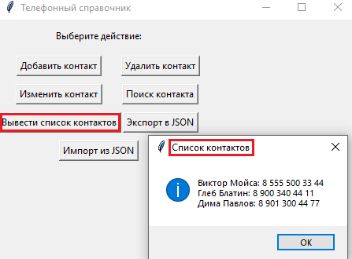

# Телефонный справочник

Это консольное приложение для управления телефонным справочником. Оно позволяет добавлять, удалять, изменять данные контакта, искать и отображать контакты, а также экспортировать и импортировать данные в формате JSON.

## Использование

Приложение предоставляет следующие функции:

- **Добавление контакта:** Нажмите кнопку "Добавить контакт" и введите имя, фамилию и номер телефона нового контакта.
- **Удаление контакта:** Нажмите кнопку "Удалить контакт" и введите имя и фамилию контакта, который хотите удалить.
- **Поиск контакта:** Нажмите кнопку "Поиск контакта" и введите ключевое слово для поиска. Появится список контактов, содержащих это ключевое слово.
- **Вывод списка контактов:** Нажмите кнопку "Вывести список контактов", чтобы увидеть все контакты в телефонном справочнике.
- **Изменение контакта:** Нажмите кнопку "Изменить контакт", затем по ключевому слову найти нужный и изменить его.
- **Экспорт в JSON:** Нажмите кнопку "Экспорт в JSON", чтобы сохранить данные в формате JSON.
- **Импорт из JSON:** Нажмите кнопку "Импорт из JSON", чтобы загрузить данные из файла JSON.

## Пример использования

1. Добавление нового контакта:
    
    1.1  Ввести имя
    
    1.2 Ввести фамилию

    1.3 Ввести номер телефона

    1.4 Контакт добавлен :D 

2. Вывод списка контактов:
    
    2.1 Выводит все добавленые контакты

3. Поиск контакта:

    3.1 Выполняет поиск контакта по ключевому слову
    * Например по имени, фамилии или номеру телефона

